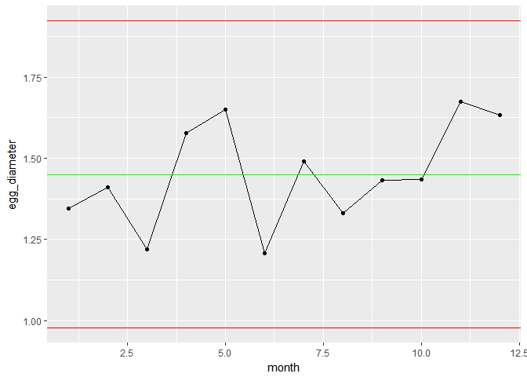

<!-- README.md is generated from README.Rmd. Please edit that file -->
Description
===========

Plot single and multi-facet quality control charts within the ggplot framework using stat\_QC and stat\_mR. Calculate quality control limits using QC\_Lines.

Methods supported:

-   **Individuals Charts** : mR, XmR
-   **Attribute Charts** : c, np, p, u
-   **Studentized Charts**: xBar.rBar, xBar.rMedian, xBar.sBar, xMedian.rBar, xMedian.rMedian
-   **Dispersion Charts**: rBar, rMedian, sBar

Example
=======

``` r
library(ggplot2)
library(ggQC)


set.seed(5555)
Golden_Egg_df <- data.frame(month=1:12,
                 egg_diameter = rnorm(n = 12, mean = 1.5, sd = 0.2)
                 )

XmR_Plot <- ggplot(Golden_Egg_df, aes(x = month, y = egg_diameter)) +
               geom_point() + geom_line() + 
               stat_QC(method = "XmR")

XmR_Plot
```



Installation
============

-   cran: install.package("ggQC")
-   github: devtools::install\_github("kenithgrey/ggQC")

Overview
========

-   QC\_Lines() : Output quality control chart data in table format
-   stat\_QC() : ggplot stat to generate control charts supported methods
-   stat\_mR(): ggplot stat to generate mR chart.
-   stat\_QC\_labels(): ggplot stat to write text labels on control chart center line and limits.
-   30 plus functions to calculate specific control chart constants. (recommend using QC\_Lines())

More Examples
=============

For more Information and Examples using ggQC, visit ([ggQC.r-bar.net](http://ggQC.r-bar.net/index.html))
